

# Egle: Music Library Manager, HiFi Player & Mass Tag Editor for Windows

**All-in-one music suite for Windows: batch tag editor with audio fingerprint recognition, bit-perfect HiFi player, a 3D shelf with vinyl records, CDs and cassettes, FLAC authenticity checker, cover-art manager and an AutoEQ to Rockbox converter, all in a single 15 MB native app.**

[**⬇️ Download**](#-download) · [**✨ Features**](#-features) · [**🎧 Supported formats**](#-supported-formats) · [**💜 Support on Patreon**](https://www.patreon.com/cw/egleMusic)

---

## What is Egle?

**Egle** is a fast, native Windows desktop app to organize, clean, tag and play your music library. It puts together six tools that usually need five different programs:

- a **mass tag editor** that can auto-fix MP3 and FLAC tags, recognize a song from the audio itself and fill in the official details, remove the "explicit" tag for you, tidy up genres and artist separators, renumber tracks, calculate ReplayGain for even volume and clear junk metadata across thousands of files at once;
- a **bit-perfect HiFi music player** with ReplayGain, gapless album playback and automatic sample-rate switching;
- a **music library manager** with albums, artists, genres, playlists, favorites, listening history, a duplicate finder, smart playlists from plain-language queries and a 3D cover-flow view where your albums can look like vinyl records, CDs or cassettes;
- a **FLAC authenticity checker** (real-time spectrogram) to spot fake or transcoded FLACs;
- a **cover-art / DAP manager** to embed, resize and clean artwork across formats, sync albums to a Rockbox player at any folder depth, and compare tags and quality between PC and device;
- an **AutoEQ to Rockbox EQ converter** for your DAP.

It can also fill in what your files never had: artist photos and biographies, album covers, lyrics and worldwide play counts, fetched from the web and all sitting behind a single switch you can turn off.

It is built with Rust and Tauri, so it is a single light `.exe` (around 15 MB). No Electron bloat, no background services, no telemetry.

> 📥 You can download Egle directly. Grab the latest Windows build from the [**Releases**](https://github.com/EgleAudioSuite/egle/releases/latest) tab. If you want to support the project, there is also [Patreon](https://www.patreon.com/cw/egleMusic).

---

## 📸 Screenshots

| Music Library | Now Playing |
|:---:|:---:|
| 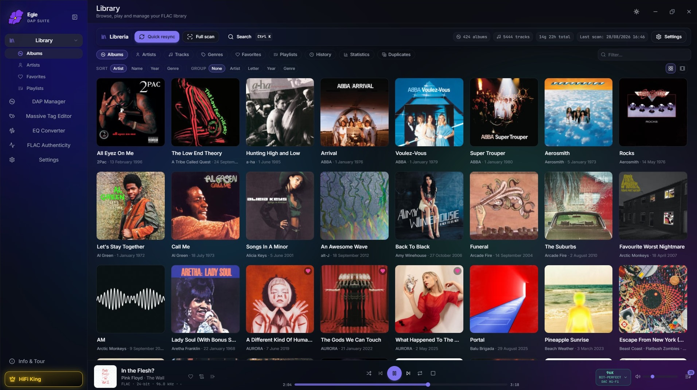 | 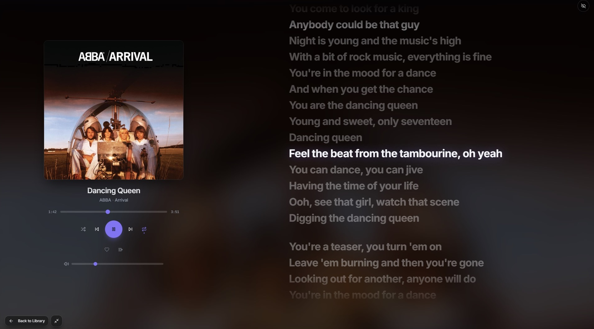 |

| Picture Flow: vinyl, CDs and cassettes in 3D | Manage views: a look per album, artist, genre or era |
|:---:|:---:|
| 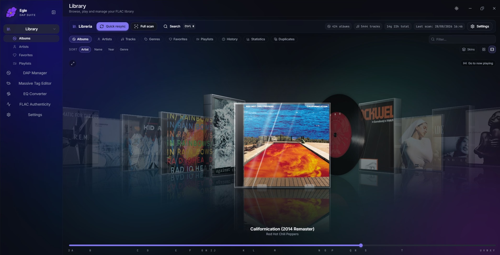 | 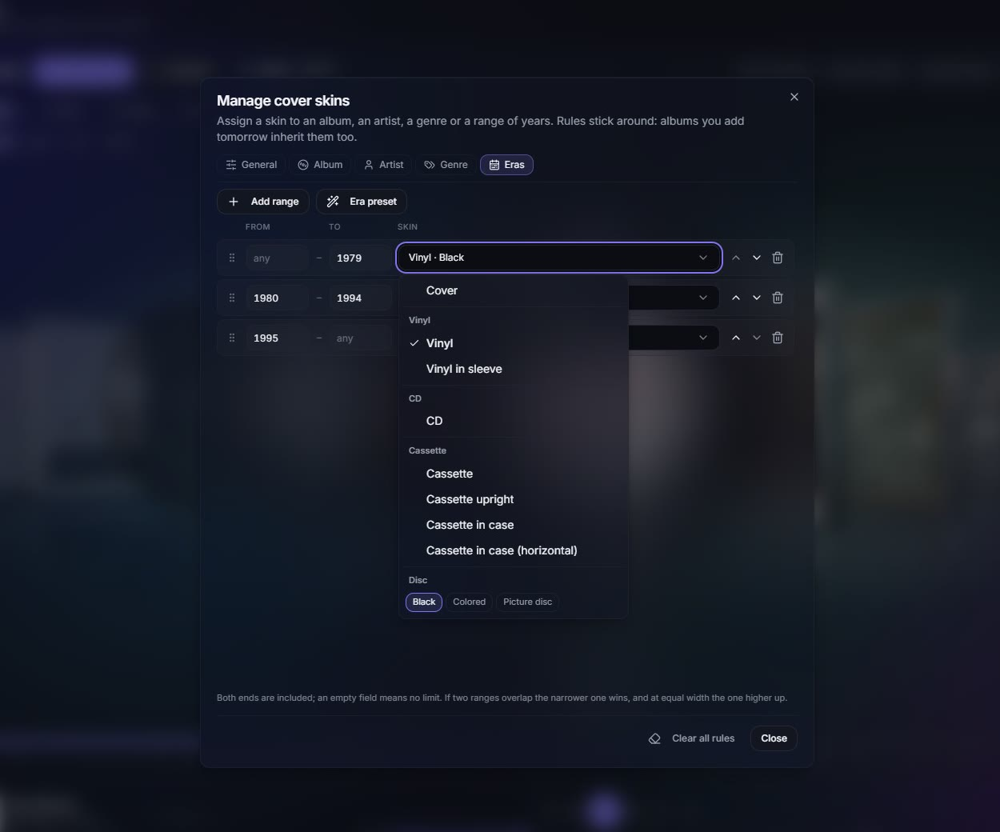 |

| Graphic mods: replace the artwork with your own | Artists, with photos found online |
|:---:|:---:|
| 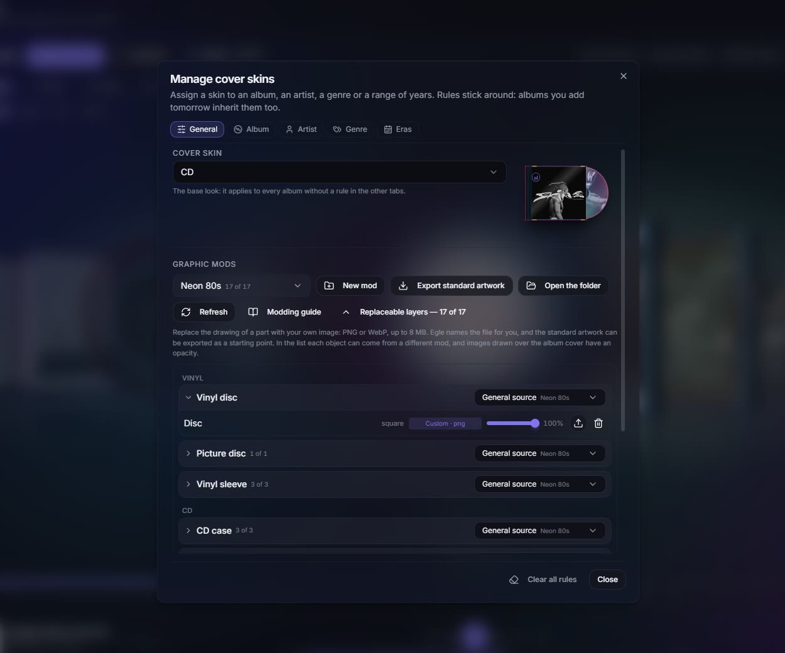 | 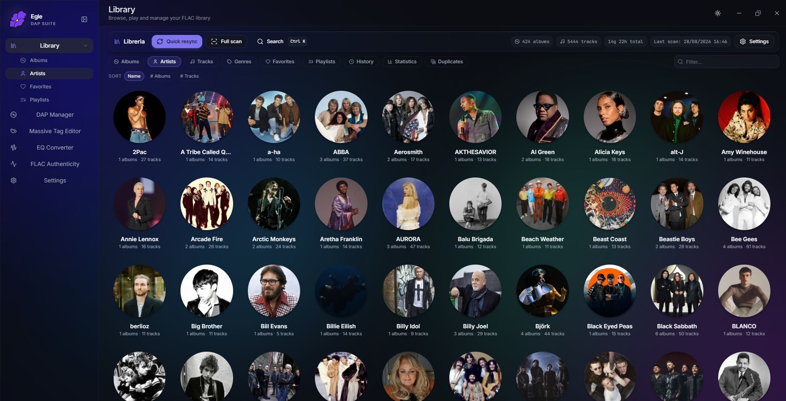 |

| Artist page with biography and details | Massive Tag Editor: easy tool to organize your library |
|:---:|:---:|
| 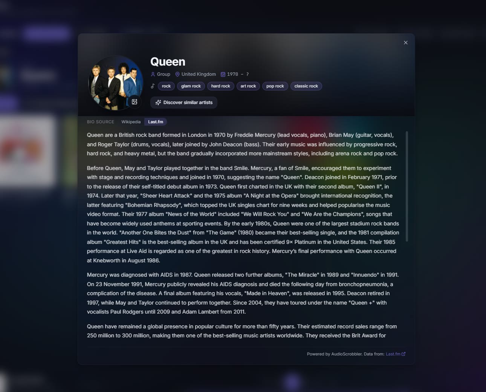 | 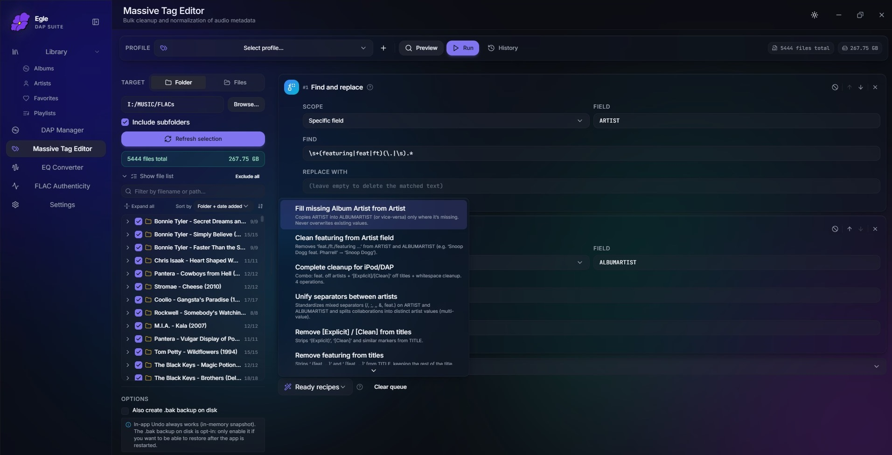 |

| Smart Playlists (plain-language, offline) | DAP Manager (iPod / Rockbox / MP3 player sync) |
|:---:|:---:|
| 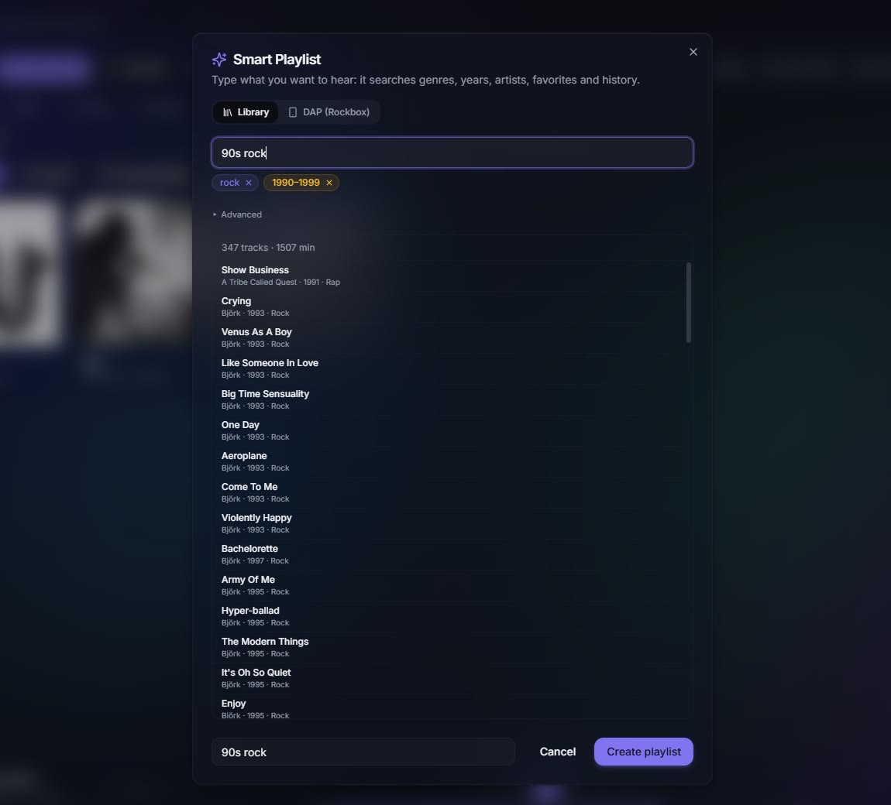 | 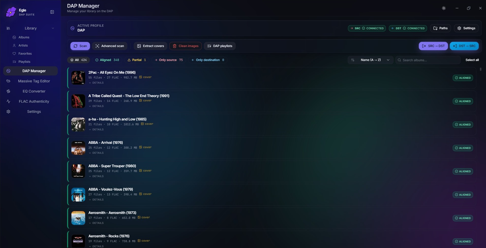 |

| FLAC Authenticity Checker | AutoEQ to Rockbox EQ Converter |
|:---:|:---:|
| 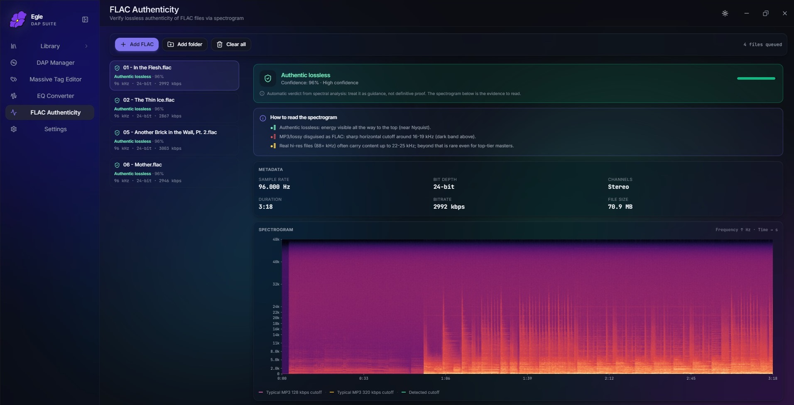 | 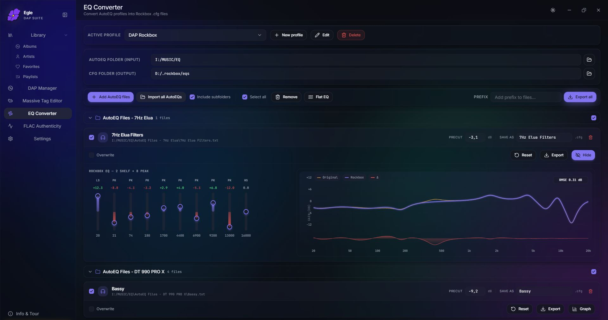 |

---

## ✨ Features

### 🧹 Massive Tag Editor: clean up your whole library

This is the tool most people open Egle for. You build a list of operations and run it on a folder or a set of files. You get a live diff preview before anything is written to disk, plus an in-memory Undo:

- Auto-fix MP3 / FLAC / M4A tags in bulk: clean whitespace, hidden BOM and zero-width characters, fix capitalization (Title / UPPER / lower / Sentence case).
- **Identify tracks from the audio itself.** Egle listens to the file, matches its acoustic fingerprint against AcoustID and fills in the official MusicBrainz title, artist, album, year and track number. It works on files with no tags at all and on files whose tags are simply wrong, because it never trusts what is already written. By default it only fills fields that are empty, so it cannot damage a library you already curated, and a ready-made **Auto Tagging** recipe is waiting in the recipes menu.
- Remove the "explicit" tag automatically, and drop any non-standard junk tags (MusicBrainz, iTunes, foobar2000 leftovers). The recommended ones are pre-selected for you.
- Find and replace with plain text or regex across title, artist, album, genre and more.
- Normalize genres and values: merge spelling variants (like `Hip-Hop` vs `Hip Hop`) into one value, with automatic clustering of the variants and manual targeting when you want it (for example map `Rap` to `Hip-Hop`).
- Normalize artist separators, dedupe featured artists, renumber tracks per disc, sync ARTIST and ALBUMARTIST.
- Calculate ReplayGain for volume normalization: Egle measures the loudness of each track and album with the ITU-R BS.1770 standard (the same one foobar2000 uses) and writes the standard ReplayGain tags, so your whole library plays at an even volume. Track, album or both, with a reference loudness setting and an option to skip files that already have the tags.
- Apply cover art to many files at once, with Lanczos resize and JPEG quality control.
- Optional `.bak` backups for cross-session recovery.

### 🔊 Bit-Perfect HiFi Player

Lossless (FLAC / ALAC / WAV / AIFF) and lossy (MP3 / AAC / Vorbis / Opus) playback, powered by Symphonia and CPAL. Automatic per-track sample-rate switching, gapless album playback and optional crossfade, ReplayGain (off / track / album), Windows media-key and SMTC integration, and a real Bit-Perfect badge that only lights up when there is no resampling in the chain. A full-screen Now Playing view shows the cover, controls and large lyrics that scroll line by line.

### 🎼 Music Library Manager

An indexed database of your whole collection: albums, artists, tracks, genres, playlists, favorites, listening history and statistics. Flexible folder-layout scanning (Auto, Artist-Album, or a custom token template), instant search (`Ctrl+K`), and the 3D Picture Flow cover view described below.

Every track list lets you pick which columns to show and in what order, and the choice applies at once across the whole Library. Two of them are worth knowing about: **Plays**, how many times you played a track in Egle, and **Listens**, how many times it has been played worldwide. Both can sort the list, and columns can be resized by dragging.

The **Statistics** page opens with your listening time for the period in large type, next to how it compares with the period before, your streak and your totals, a real podium for your top artists, and a card for your most played song.

There is also a built-in **duplicate finder**: it spots songs that appear more than once in your library (same artist and title, similar length), even when the copies are in different formats or quality, like the same track ripped to both FLAC and MP3. It marks the best copy of each group and lets you send the worse ones to the Recycle Bin in a couple of clicks, so cleaning up gigabytes of doubled music takes minutes, and nothing is ever deleted for good.

### 💿 Picture Flow: your albums as records, CDs and tapes

Picture Flow is the 3D cover view of your library, and it does not have to show flat covers. You choose in two steps, first the container and then the model: **eight entries covering twenty-four combinations**. An album can be a vinyl record on its own or inside its sleeve (black, colored or picture disc), a CD in a jewel case, or a cassette lying down or standing up, in its box or out of it, in one of three shells.

When the album on screen is the one playing, the object comes out of its box. The record slides out of the sleeve and turns, the disc slides out of the jewel case, and the cassette tape really winds from one reel to the other as the song goes on.

A **Manage views** window sets the look with rules instead of one album at a time: pick a look for a single album, an artist, a genre or a range of years, so your seventies records can be vinyl while the nineties are CDs, and albums you add later follow the same rule.

### 🎨 Graphic mods: draw your own records and tapes

If you do not like the artwork Egle draws, you can replace it. A **mod** swaps any of **seventeen parts** (the record, the sleeve, the jewel case, the disc, the cassette shell, the tape, the hubs, the box and their sides) for a PNG or WebP of yours, a straight photo of a real tape included. Every part ships with the drawing Egle uses for it, so you open the file, paint over it and save: you never start from a blank canvas and you never have to guess a file name. Egle copies and renames your file for you, and tells you if the proportions, the transparency or the size look wrong.

Mods live in named folders, so you can keep several, switch between them from a menu, mix them object by object, or share one by sending the folder. Full reference, with the standard artwork downloadable from it: [how to make a Picture Flow mod](docs/picture-flow-mods.md).

Picture Flow rules and mods are Supporter features. Picking the default look is free.

### 🌐 Online lookups, behind one switch

Music collected over the years is usually missing something. Egle can fill in the gaps:

- **Artist photos and biographies.** When a file has no artist picture in its tags, Egle finds one online, so your Artists page shows faces instead of album covers. Names shared by several artists are sorted out by matching your own albums instead of taking the most popular result. Click the photo and you get a biography in your own language, plus type, country, active years and genres. If a photo is still wrong you can pick another from everything found, and your choice is saved and used everywhere.
- **Missing album covers.** Albums with no picture in the files and no folder image no longer sit as grey placeholders. Supporters also get a **Save cover** button that writes the cover into every track at full resolution and saves a `folder.jpg`, so it shows up on a DAP and in any other player too.
- **Lyrics.** When a song has no lyrics in its tags and no `.lrc` file next to it, Egle looks them up online, synced ones included so they scroll in time. You choose the order it searches, and a small row of buttons in the Now Playing view shows where the current lyrics come from and lets you switch source for that song.
- **Worldwide play counts**, as a column in any track list and next to an artist.
- **Discover similar.** A panel that opens from any artist, album or song and shows you music like what you are already playing, telling you what you already own and what you do not. Every suggestion can be explored further in one click, so you can keep wandering from one thing to the next. Smart Playlists learned the same trick, with an *Include similar artists* chip.

All of it lives in **Settings, under Library**, behind a single master switch, and every lookup has its own switch plus a plain line saying what it fetches and from which service. Turn the master off and Egle works entirely offline, the way it always did. Artist photos, biographies, covers, lyrics and play counts are free on every tier; Discover similar and saving a cover into your files are Supporter features. A few lookups use your own free Last.fm or AcoustID key, which you paste once in Settings.

### 🏷️ Universal Tag Editor

Edit tags and lyrics (including synced LRC) on any supported format through one API. Vorbis Comments, ID3v2 and MP4 atoms are all handled the same way.

### 📃 Playlists with custom covers

Create and manage playlists, import and export them as M3U / M3U8 / PLS, set a custom cover image, and get an automatic 2x2 cover mosaic when you do not.

### 🧠 Smart Playlists

Type what you want in plain language, like `90s r&b`, `best of Radiohead` or `most played`, and Egle builds the playlist for you. It runs fully offline, no account and no cloud: it reads your library, your favorites and your listening history right on your machine. Save the result as a normal playlist in your Library, or send it straight to a Rockbox DAP as an `.m3u8`.

It also transfers playlists between your PC and your DAP. Egle matches the same songs on both sides even when the file paths are different, writes the playlist on the device, and can copy over the songs that are missing. A `PC | DAP` switch on the Playlists page lets you list, open, create, rename and delete the playlists already on your connected player. Saving and writing to a DAP are Supporter features.

### 📈 FLAC Authenticity Checker

A real-time spectrogram (FFT) to spot fake or up-transcoded FLAC files at a glance.

### 🎚️ AutoEQ to Rockbox EQ Converter

Turn AutoEQ headphone profiles into native Rockbox `.cfg` parametric-EQ files, with biquad fitting (L-BFGS-B) and a live response graph. Batch import with sub-folder organization.

### 💿 Cover-Art / DAP Manager

Scan albums and embed, resize, extract or clean cover art across FLAC, MP3, M4A, OGG, WAV and AIFF. It reads any folder layout (Auto mode finds your albums at any depth, so Artist / Album collections from MusicBee, iTunes, foobar2000 or a NAS show up without any setup) and mirrors that same structure onto your DAP when it copies.

There is also an advanced scan: for the files you have on both your PC and your DAP, it compares the tags and the audio quality, shows you exactly what differs (quality, tags or just modified), and re-syncs the ones you pick in either direction, with live speed and ETA. Handy when you are getting a Rockbox DAP ready or keeping it in sync.

### Plus

Portable mode · 7 languages (EN / IT / FR / ES / DE / PT / JA) · custom color-palette editor · full backup and restore to a single `.zip` · glass UI · guided onboarding tour.

---

## How Egle compares

A lot of people land on Egle coming from another music app, so here is where it fits. The whole point of Egle is simple: those tools each do one piece of the job, while Egle does all of it inside one app, with a clean modern look, and for free.

- **From Mp3tag or TagScanner:** the same batch tag editing you already know, plus a live preview of every change, an undo history and ready-made cleanup recipes. Egle also recognizes a song from the audio itself and writes the official details, which is the case those tools leave you to solve by hand. And it does not stop at tags: it plays your music, manages your cover art and syncs your library to a DAP, all in the same window.
- **From MusicBee or MediaMonkey:** Egle is far lighter (one 15 MB app, installing is optional) and nicer to look at, and it still covers the full job: library, tagging, bit-perfect playback and DAP sync, without the clutter. Artist photos, biographies and missing covers get filled in for you instead of needing a plugin.
- **From foobar2000:** the bit-perfect playback you expect, but with a real bulk tag editor, a cover-art manager and a FLAC authenticity checker already built in, wrapped in a modern interface and with no extra components to track down.
- **From MusicBrainz Picard:** the same fingerprint matching against AcoustID and the same official MusicBrainz data, except here it is one operation inside a wider cleanup pass, it fills only the fields you let it touch, and it shows you the result file by file before writing anything.
- **Coming from a Rockbox or iPod setup:** Egle scans your library at any folder depth, mirrors it onto the player, syncs the cover art, builds smart playlists straight onto the device, and can compare tags and audio quality between PC and DAP to keep both sides in sync. The AutoEQ to Rockbox EQ converter lives in the same app.

One app instead of five, easy on the eyes, and free to download and use. Windows only for now.

---

## 🎧 Supported formats

| Format | Tags | Lossless |
|--------|:----:|:--------:|
| FLAC | ✅ | ✅ |
| MP3 | ✅ | ❌ |
| M4A / MP4 (AAC / ALAC) | ✅ | ALAC ✅ |
| AAC | ✅ | ❌ |
| OGG Vorbis | ✅ | ❌ |
| Opus | ✅ | ❌ |
| WAV | ✅ | ✅ |
| AIFF | ✅ | ✅ |

---

## ⬇️ Download

You can download Egle directly, no account needed.

- **📦 [Download from GitHub Releases](https://github.com/EgleAudioSuite/egle/releases/latest)**: the latest Windows build as a zip (`Egle_vX.Y.Z.zip`). Start here.
- **💜 [Egle on Patreon](https://www.patreon.com/cw/egleMusic)**: the same app, and the place to support development. Becoming a supporter unlocks higher limits and a few extra features (bigger libraries, more profiles, color palettes, Picture Flow rules and mods, track identification, backup).

### Installer or portable, your choice

The zip is not just a loose `.exe`. Inside you get both ways to run Egle, so pick the one you prefer:

- **Installer**: run the setup and Egle installs like a normal Windows app, with a Start menu shortcut and an uninstaller.
- **Portable**: just unzip and launch the `.exe`. Nothing gets installed and nothing is written to the system. It keeps its settings in a file right next to the executable, so it works great from a USB stick.

> Egle is closed-source freeware. This repository only holds the documentation and the release builds; the source code stays private. See [LICENSE](LICENSE).

---

## 🖥️ System requirements

- Windows 10 or 11 (64-bit)
- WebView2 runtime (already on Windows 11; the setup installs it on Windows 10)
- about 50 MB of free disk space

No .NET, no Java, no Python, no background services.

---

## 💜 Support

Egle is made by one person and it runs on Patreon support. If it saves you time with your music, becoming a [supporter](https://www.patreon.com/cw/egleMusic) helps a lot: it funds new features and keeps the app free for everyone.
